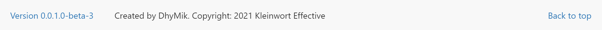

## DhyMik.DocFx.UpdateDocFxVersionAttributeTask
Current version: v1.1.0 (2021-06-24)

### Show up-to-date version information in your DocFx documentation

#### Summary

This MS build task adds dll version information to a DocFx configuration file
and keeps it in sync with the project's version information on every build.
In addition, `globalMetadata` attributes are written as css variables to a css file.
In this way, the documentation pages generated by DocFx can contain
up-to-date version information without the need for manual updates of the DocFx
configuration file.

A full markup example of how to display a version link in the header and footer of
DocFx generated documentation is included [below](#example).

#### How it works

##### Updating docfx.json with `_DocumentationVersion` attribute

`UpdateDocFxVersionAttributeTask` adds a simple MS build task to the project which, on each build,
by default takes the `InformalVersion` value of the project's output dll and updates a custom
`_DocumentationVersion` attribute value inside of the project's `docfx.json`.

> - the path to the `docfx.json` to be updated can be customized. By default, `UpdateDocFxVersionAttributeTask` looks for the `docfx.json` file in the root of the current project. For an example see [here](#otherDocfxjson)
>
>- the path to the dll file from which the version information is being taken can be customized. By default, `UpdateDocFxVersionAttributeTask` looks at the project's output dll. For an example see [here](#otherdll).

The installation adds the `UpdateDocFxVersionAttribute` target to the build, which is defined in
[DhyMik.DocFx.UpdateDocFxVersionAttributeTask.targets](DhyMik.DocFx.UpdateDocFxVersionAttributeTask.targets).
This target runs
- after the default MsBuild `build` target
- if DocFx is installed in the same project, it will run before the DocFx `DocBuild` target, so DocFx uses current version information.

`UpdateDocFxVersionAttributeTask` adds or updates the custom `_DocumentationVersion` attribute in `docfx.json`:

````JSON
{
  "metadata": [
    {
      "//1": "other content skipped for brevity"
    }
  ],
  "build": {
    "//2": "other content skipped for brevity",
    "globalMetadata": {
      "_DocumentationVersion": "0.0.1.0-beta-3"
    },
  }
}
````

By default, the value of the `_DocumentationVersion` attribute is taken from the project's output dll's
`InformalVersion' attribute.

##### Generation of css variable file

In a second step, all attributes found in `globalMetadata` inside of `docfx.json` are being written as css variables to a `globalMetadataVariables.css` file:

````css
:root {
    --_DocumentationVersion: "0.0.1.0-beta-3";
}
````

##### Usage

The custom `_DocumentationVersion` value can now be used in DocFx template files, using the regular DocFx `{{{attributeName}}}` template syntax.

However, there are places in DocFx templates where changing the template markup has no effect, because the markup is being overwritten dynamically by Javascript. For these places, it is still possible to add text through css `:before` and `:after` pseudo elements, using the generated variables in `globalMetadataVariables.css` as a data source.

These are two ways to display version information of the documentation, and the displayed value will always correlate with your project version automatically.

> **Please note**:
>
> DocFx must run after an update to the docfx.json or the generated css file occured, in order for the updated version information to appear on the generated documentation pages.

Example header:


Example footer:



See the fully working example [here](#example).

#### Compatibility
This project is a NetStandard 2.0 project. It runs as part of the MS build process.

#### Versions

For version information see the [versions file](versions.md).

### Installation

#### If DocFx is installed inside of the documented project:

If DocFx is installed in the project for which the documentation is being built,
simply use Nuget to install `UpdateDocFxVersionAttributeTask` into the project:
````d
> nuget add DhyMik.DocFx.UpdateDocFxVersionAttributeTask
````

`UpdateDocFxVersionAttributeTask` runs before DocFx is being invoked and it will
look for the `docfx.json` file to be updated in the project root directory.

#### If DocFx *is not* installed inside of the documented project:

If DocFx is not installed inside of the documented project, the `docfx.json` file
will not be found in the project's root directory, and an additional step is necessary
to tell `UpdateDocFxVersionAttributeTask` where to find `docfx.json`.

Install `UpdateDocFxVersionAttributeTask` from Nuget into the project which produces
the dll that contains the relevant version information.

Then add the following markup to the project file inside of the `<Project>` tag,
or to a `directory.build.targets` file in or above the project dir, and adjust
the value for the `UpdateDocFxVersionAttributeTask_DocFxJsonPath` attribute:

````xml
<Project>

  <PropertyGroup>
    <!-- 'UpdateDocFxVersionAttributeTask_DocFxJsonPath' can be overridden. Default is 'docfx.json' -->
    <UpdateDocFxVersionAttributeTask_DocFxJsonPath>..\..\MySeparateDocFxProject\docfx.json</UpdateDocFxVersionAttributeTask_DocFxJsonPath>
  </PropertyGroup>

</Project>
````
Now the updated value for `UpdateDocFxVersionAttributeTask_DocFxJsonPath` will be used
and the specified DocFx configuration file will be updated.

### Issues and Contributions
- If you have a problem with or a question about this software, please open an issue
on the issue tracker.
- If you feel to improve or enhance this software, please make a pull request.

<a name="example" />

### Example: Displaying the version information in DocFx templates

With the version information inside docfx.json, it is easy to integrate it into the
auto-generated documentation pages. Here is a fully working example for how to display version and title information.  

> What we want to achieve:
>
> - the documentation pages do not indicate the software version which is being documented. So we want to add a link into the header and footer of all pages that displays the version and links to a version info file.
> - there is no indication on the pages which software is being documented, other than the logo. So we want to add the app title in a prominent place without wasting any real estate: the breadcrumb bar right underneath the navbar is perect.

**What we will do:**

- add markup for a link into the auto-generated header and the footer. The link displays the current version and links to a version file which can also be defined inside docfx.json, along with a link hint text.
- add a title text into the `breadcrumb` row in the header, just before the breadcrumb itself. This is a place where regular `{{{attributeName}}` syntax does not work and the auto-generated css variable is utilized.

**The example markup displayed here is based on the DocFx `default` template.**  
This template is a built-in template. After installation of DocFx, there are no template files available in the project. In order to edit the template files, you first need to generate the files. In the root of the project where DocFx is installed, run

````exe
docfx template export default
````

This will generate a `_exported_templates\default` folder with all the files of the `default` template.


#### 1. Add metadata to docfx.json:
Manually add 2 new custom attributes to the `globalMetadata` section of docfx.json. We will use them for the link:
- `_DocumentationVersionFilePath`:  
 The path and name to the file that the generated link should point to. In the example below, link will reference `versions.html` file in root folder of the generated site.  
 
- `_DocumentationVersionHint`:  
 The hint text to display when the mouse hovers over the link.  
 In the example below, hint text will dispay as `Version History`.

The `_DocumentationVersion` attribute will be added automatically by UpdateDocFxVersionAttributeTask. 

To make sure your results will resemble the example pictures presented here, add another 3 attributes. These are regular DocFx attributes:

- `_enableSearch`:
 Set this to `true` to show the search bar in the header.  
 **Hint:** Make sure that your docfx.json also contains the `postProcessors` attribute with `ExtractSearchIndex` included in the values, as shown below, otherwise the search bar will be visible but search results will always be empty.
 
- `_appTitle`:  
 As a DocFx default behavior, the string assigned to `_appTitle` will appear in the browser title. We will also display it next to the breadcrumb in the header, using the css variables method.

- `_appFooter`:  
 The string assigned to `_appFooter` will appear in the footer. This is regular DocFx behavior.

In a last step, reference the template files you generated earlier. Add the `template` attribute as shown in the `docfx.json` example below. Adjust the template path if your template files sit elsewhere.

> **Please note:** The auto-generated css file will be written in the `styles` subfolder of the last specified template path. If no template attribute is specified, the css file will be written in the root folder of the project.

Your `docfx.json` file should now have content similar to this:

````JSON
{
  "metadata": [
    {
      "//1": "other content skipped for brevity"
    }
  ],
  "build": {
    "//2": "other content skipped for brevity",
    "globalMetadata": {
      "//1": "other content skipped for brevity",
      "_enableSearch": true,
      "_appTitle": "DhyMik.CoolClassLibrary Docs",
      "_appFooter": "Created by DhyMik. Copyright: 2021 Kleinwort Effective",
      "_DocumentationVersionHint": "Version History",
      "_DocumentationVersionFilePath": "versions.html",
      "_DocumentationVersion": "0.0.1.0-beta-3"
    },
    "postProcessors": [
      "ExtractSearchIndex"
    ],
    "template": [
      "_exported_templates\default"
    ]
  }
}
````
DocFx allows regular and custom attributes which are defined in the `globalMetadata` section to be picked up inside of the template files. Using the `{{{attributeName}}}` syntax, these values can be used inside of DocFx markup files, which we will utilize in the next two steps.

#### 2. Add markup to DocFx navbar template file:

To display our version link in the page header, edit `navbar.tmpl.partial`
in the DocFx template folder's `partial` folder.

In `navbar.tmpl.partial`, add the following line right before the opening `<form>` tag:

````html
<a class="version versionHeader" href="{{{_DocumentationVersionFilePath}}}" title="{{{_DocumentationVersionHint}}}">Version {{{_DocumentationVersion}}}</a>
```` 
The [complete file](doc/navbar.tmpl.partial) can be found in the [doc folder](doc) and will look like this:
````html
{{!Copyright (c) Microsoft. All rights reserved. Licensed under the MIT license. See LICENSE file in the project root for full license information.}}

// modified file 'navbar.tmpl.partial' from DocFx 'default' template with markup to display version link:

<nav id="autocollapse" class="navbar navbar-inverse ng-scope" role="navigation">
  <div class="container">
    <div class="navbar-header">
      <button type="button" class="navbar-toggle" data-toggle="collapse" data-target="#navbar">
        <span class="sr-only">Toggle navigation</span>
        <span class="icon-bar"></span>
        <span class="icon-bar"></span>
        <span class="icon-bar"></span>
      </button>
      {{>partials/logo}}
    </div>
    <div class="collapse navbar-collapse" id="navbar">

      // added version link:
      <a class="version versionHeader" href="{{{_DocumentationVersionFilePath}}}" title="{{{_DocumentationVersionHint}}}">Version {{{_DocumentationVersion}}}</a>

      <form class="navbar-form navbar-right" role="search" id="search">
        <div class="form-group">
          <input type="text" class="form-control" id="search-query" placeholder="{{__global.search}}" autocomplete="off">
        </div>
      </form>
    </div>
  </div>
</nav>
````

#### 3. Add markup to DocFx footer template file:

To display our version link in the footer, edit `footer.tmpl.partial`
in the DocFx template folder's `partial` folder.

In `footer.tmpl.partial`, add the following line right before the last opening `<span>` tag:

````html
<a class="version versionFooter" href="{{{_DocumentationVersionFilePath}}}.html" title="{{{_DocumentationVersionHint}}}">Version {{{_DocumentationVersion}}}</a>
```` 

The [complete file](doc/footer.tmpl.partial) can be found in the [doc folder](doc) and will look like this:
````html
{{!Copyright (c) Microsoft. All rights reserved. Licensed under the MIT license. See LICENSE file in the project root for full license information.}}

// modified file 'footer.tmpl.partial' from DocFx 'default' template with markup to display version link:

<footer>
  <div class="grad-bottom"></div>
  <div class="footer">
    <div class="container">
      <span class="pull-right">
        <a href="#top">{{__global.backToTop}}</a>
      </span>

      // added version link:
      <a class="version versionFooter" href="{{{_DocumentationVersionFilePath}}}.html" title="{{{_DocumentationVersionHint}}}">Version {{{_DocumentationVersion}}}</a>

      <span>
      {{{_appFooter}}}
      {{^_appFooter}}Generated by <strong>DocFX</strong>{{/_appFooter}}
      </span>
    </div>
  </div>
</footer>

````

#### 4. Add css to DocFx main.css file

##### Style the markup for the version links

Now we need to find the css file used by the template, so we can add some simple css rules for our header and footer markup. The file we are looking for is `main.css` and it lives in the `styles` subfolder of the template folder which you specified earlier through the `template` attribute in `docfx.json`.

The `main.css` file of DocFx is the place for custom css, and is initially empty. It is automatically picked up by DocFx.

Add the following css to the `main.css` file:

````css
/* Style the version links in header & footer:
 */
.version.versionHeader {
  display: inline-block;
  line-height: 20px;
  padding: 15px 30px 15px 30px; }

.version.versionFooter {
  padding-right: 30px; }
````

These rules make sure our additional markup sits nicely with the default design of the DocFx default template. Adjust to your liking.

##### Include the generated `globalMetadataVariables.css` file

Now what's left to accomplish is to display the app title next to the breadcrumb in the header. If you try to do this using regular DocFx markup syntax like `<span>{{{_appTitle}}}</span` inside of `breadcrumb.tmpl.partial`, you will notice that although the generated html file does include your additional markup, the served pages don't! Javascript has removed the additional content.

But we can use the css `:before` and `:after` pseudo elements to add text in front of or after elements in those cases where we can't, or don't want to, add additional markup inside of DocFx template files. For our task, we will add a `:before` pseudo element to the breadcrumb.

If you build the project at this time, `UpdateDocFxVersionAttributeTask` will already generate the `globalMetadataVariables.css` file. If your `docfx.json` resembles the one shown above, the css content will contain an auto-generated css variable for each element of the `globalMetadata` attribute, looking like this:

````css
/*
 * This file was created by DhyMik.DocFx.UpdateDocFxVersionAttributeTask.
 *
 * Do not change this file - changes will be overwritten.
 *
 * This file is based on data from 'globalMetadata' section in docfx.json.
 * Edit 'globalMetadata' section of docfx.json instead.
 */
:root {
    --_enableSearch: "true";
    --_appFooter: "Created by DhyMik. Copyright: 2021 Kleinwort Effective";
    --_enableNewTab: "true";
    --_appTitle: "DhyMik.ClassLibrary Documentation";
    --_DocumentationVersionHint: "Version History";
    --_DocumentationVersionFilePath: "versions.html";
    --_DocumentationVersion: "0.0.1.0-beta-3";
}
````

For each attribute in the `globalMetadata` attribute of `docfx.json`, a new css variable has been defined. We are now going to use the `--_appTitle` variable to accomplish our task.

First, we need to reference the generated `globalMetadataVariables.css` file inside of `main.css` to make the defined variables available. If you are using the example setup described here, both files reside in the same folder. In this case, add the following line at the very top of the css file. It is important that all `@import` statements come before any other content - even before any comments:

````css
@import "globalMetadataVariables.css";
````

##### Display the app title next to the breadcrumb

Now we can add some css which uses the `--_appTitle` css variable to display the app title next to the breadcrumb. By using the browser developer tools, it's easy to decide which element we need to target with your css. In this example, we choose to add our pseudo content to the markup element with the `.breadcrumb` class:

````css
/* styles to include app title next to breadcrumb under logo:
 */
.breadcrumb::before {
    content: var(--_appTitle) ":";
    padding-right: 20px;
}
````

**Tip:** You can concatenate any number of strings in the value of the `content` attribute **without using operators**. In the example above, we display a colon ':' after the app title. If you would also want to include the version number, you might want to use this css instead:

````css
/* styles to include app title and version info next to breadcrumb under logo:
 */
.breadcrumb::before {
    content: var(--_appTitle) " v" var(--_DocumentationVersion) ":";
    padding-right: 20px;
}
````

##### For the perfectionist

If you are a little perfectionistic like me, you will not like the fact that after a click on any anchor link in DocFx documentation, the target anchor will be invisible - it will be hidden under the floating header navbar. Not a big deal, but confusing. It is easy to change this with a little bit of css, so why not do it here since we are at it.

Add this css to `main.css`:

````css
/* Fix scroll to anchor behavior for tablet and desktop,
    so scroll target is not hidden by floating nav bar
 */
@media only screen and (min-width: 769px) {
    .article a[name] {
        /* move anchor up 75px so page scrolls further down */
        position: absolute;
        top: -75px;
    }
    p {
        /* <p> must have ' position: relative' in order to make 
         * 'position: absolute' of the preceeding rule work
         */
        position: relative;
    }
}
````

The default blockquote style of DocFx is not to my liking either - font size is way too large for my taste. If you agree, add this rule to your `main.css`:

````css
/* Improve blockquote style: original font-size too large
 */
blockquote {
    font-size: 1.03em;
    background-color: rgb(250, 250, 246);
}
````

##### The complete css

You can find the completed file in the [doc](doc) folder [here](doc/main.css).


#### 5. The result
Now build the project so DocFx recreates the documentation site files. The exact data displayed depends on what you put into your `docfx.json` and on the `version` data of your project, but the result should look something remotely like the following two images.

In the header, we have the version link in the main menu, displaying the version. And our project name is now nicely displayed right in front of the breadcrumb. The footer now also features our new version link, in front of the regular app title display.

Header:


Footer:


<a name="customsetup" />

### Custom Setup

<a name="otherdll" />

#### Updating a docfx.json file which is not in the project root

If the `docfx.json` file to be updated is not found in the project's root directory,
add the following markup to the project file inside of the `<Project>` tag, or to a `directory.build.targets` file
in or above the project dir, and adjust the value for the
`UpdateDocFxVersionAttributeTask_DocFxJsonPath` attribute:

````xml
<Project>

  <PropertyGroup>
    <!-- 'UpdateDocFxVersionAttributeTask_DocFxJsonPath' can be overridden. Default is 'docfx.json' -->
    <UpdateDocFxVersionAttributeTask_DocFxJsonPath>..\..\MySeparateDocFxProject\docfx.json</UpdateDocFxVersionAttributeTask_DocFxJsonPath>
  </PropertyGroup>

</Project>
````
Now the updated value for `UpdateDocFxVersionAttributeTask_DocFxJsonPath`will be used
and the specified DocFx configuration file will be updated.

<a name="otherDocfxjson" />

#### Using a version value from another than the project's dll

By default, `UpdateDocFxVersionAttributeTask` looks at the project's output dll file
to extract the `InformalVersion` attribute value, which is then added to the
`docfx.json` file.

If another file's `InformalVersion` attribute should be the source, it is possible
to override this behavior.

For this, add the following markup to the project file inside of the `<Project>` tag, or to a `directory.build.targets`
file in or above the project dir:

````xml
<Project>
  
  <PropertyGroup>
    <!-- 'UpdateDocFxVersionAttributeTask_DllPath' can be overridden. Default is currently built dll -->
    <UpdateDocFxVersionAttributeTask_DllPath>bin\release\myApp.dll</UpdateDocFxVersionAttributeTask_DllPath>
  </PropertyGroup>

</Project>
````

### Running `DocFx serve` automatically after a successful build

DocFx comes with a very convenient way to locally serve the generated documentation site without any setup. Just run `docfx.exe serve "path__to__site"`.

To run `DocFx serve` automatically after a successful build of the documentation, you can add the following markup to the project file, or to a `directory.build.targets` file in or above the project dir. It contains a target definition and two parameter definitions for customization of site path and port number:

````xml
<Project>

  <PropertyGroup>
    <!-- Adjust this to specify your doc sites folder. DocFx default is '_site' -->
    <DocSiteFolder>_site</DocSiteFolder>
    <!-- Adjust this to specify the port number to serve the doc site on. Default is 8080. -->
    <DocSiteServingPort>8080</DocSiteServingPort>
  </PropertyGroup>

  <Target Name="DocServe" Condition="'$(BuildDocFx)' == 'true'" AfterTargets="DocBuild">
    <Exec Command="powershell start-process -FilePath docfx -ArgumentList  &apos;serve  &quot;$(ProjectDir)$(DocSiteFolder)&quot; -p $(DocSiteServingPort)&apos;" />
  </Target>

</Project>
````
This code, along with a few other examples, is included in the [example.directory.build.targets](doc/example.directory.build.targets) file in the [doc folder](doc).

### Logging

The build task logs to the standard build log output. In Visual Studio, this is the Output Window and the log file.
With Visual Studio's log level set to `normal`, a message is displayed with the current or
new value of `_DocumentationVersion`, like this:

````bat
1>  --UpdateDocFxVersionAttributeTask: Dll informal version and '_DocumentationVersion' attribute in 'docfx.json' are equal. Current value is '0.0.1.0-beta-3'. No need to update docfx.json.
1>  --UpdateDocFxVersionAttributeTask: Css file _exported_templates/default/styles/globalMetadataVariables.css written with 7 css variable declarations.
````
With log level set to `detailed`, a more detailed log will be provided.

To search the log output for log information from this build task, search for `--UpdateDocFxVersionAttributeTask`

<a name="license" />

### Copyright, License & Disclaimer

Copyright © by Mikael Axel Kleinwort (DhyMik)

This is free software and is licensed under the [The MIT License (MIT)](http://opensource.org/licenses/MIT):

Permission is hereby granted, free of charge, to any person obtaining a copy
of this software and associated documentation files (the "Software"), to deal
in the Software without restriction, including without limitation the rights
to use, copy, modify, merge, publish, distribute, sublicense, and/or sell
copies of the Software, and to permit persons to whom the Software is
furnished to do so, subject to the following conditions:

The above copyright notice and this permission notice shall be included in all
copies or substantial portions of the Software.

THE SOFTWARE IS PROVIDED "AS IS", WITHOUT WARRANTY OF ANY KIND, EXPRESS OR
IMPLIED, INCLUDING BUT NOT LIMITED TO THE WARRANTIES OF MERCHANTABILITY,
FITNESS FOR A PARTICULAR PURPOSE AND NONINFRINGEMENT. IN NO EVENT SHALL THE
AUTHORS OR COPYRIGHT HOLDERS BE LIABLE FOR ANY CLAIM, DAMAGES OR OTHER
LIABILITY, WHETHER IN AN ACTION OF CONTRACT, TORT OR OTHERWISE, ARISING FROM,
OUT OF OR IN CONNECTION WITH THE SOFTWARE OR THE USE OR OTHER DEALINGS IN THE
SOFTWARE.

### See also

This repository includes a few files as examples (see [doc folder](doc)):

- [DhyMik.DocFx.UpdateDocFxVersionAttributeTask.targets](DhyMik.DocFx.UpdateDocFxVersionAttributeTask.targets)  
 This is the targets file added to the project's build process.
- [example.directory.build.targets](doc/example.directory.build.targets)  
 This is an example `directory.build.targets` file with lots of comments. If you want to use this file, rename it to `directory.build.targets` and place it in the project's root directory or any directory above.  
 This file also includes an example of how to have DocFx automatically serve the built documentation site locally on a given port after a successful build.
- The modified files for adding the version link to DocFx markup. The file examples are based on DocFx **default template**:  
 [navbar.tmpl.partial](doc/navbar.tmpl.partial)  
 [footer.tmpl.partial](doc/footer.tmpl.partial)  
 [main.css](doc/main.css)  

