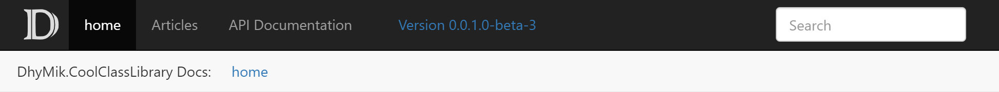

## DhyMik.DocFx.UpdateDocFxVersionAttributeTask
Current version: v1.0 (2021-06-21)

### Show up-to-date version information in your DocFx documentation

#### Summary

This MS build task adds dll version information to a DocFx configuration file
and keeps it in sync with the project's version information on every build.
In this way, the documentation pages generated by DocFx can contain
up-to-date version information without the need for manual updates of the DocFx
configuration file.

A full markup example of how to display a version link in the header and footer of
DocFx generated documentation is included [below](#example).

#### How it works

`UpdateDocFxVersionAttributeTask` adds a simple MS build task to the project which, on each build,
by default takes the `InformalVersion` value of the project's output dll and updates a custom
`_DocumentationVersion` attribute value inside of the project's `docfx.json`.

> - the path to the `docfx.json` to be updated can be customized. By default, `UpdateDocFxVersionAttributeTask` looks for the `docfx.json` file in the root of the current project. For an example see [here](#otherDocfxjson)
>
>- the path to the dll file from which the version information is being taken can be customized. By default, `UpdateDocFxVersionAttributeTask` looks at the project's output dll. For an example see [here](#otherdll).

The installation adds the `UpdateDocFxVersionAttribute` target to the build, which is defined in
[DhyMik.DocFx.UpdateDocFxVersionAttributeTask.targets](DhyMik.DocFx.UpdateDocFxVersionAttributeTask.targets).
This target runs
- after the default MsBuild `build` target
- if DocFx is installed in the same project, it will run before the DocFx `DocBuild` target, so DocFx uses current version information.

`UpdateDocFxVersionAttributeTask` adds or updates the custom `_DocumentationVersion` attribute in `docfx.json`:

````JSON
{
  "metadata": [
    {
      "//1": "other content skipped for brevity"
    }
  ],
  "build": {
    "//2": "other content skipped for brevity",
    "globalMetadata": {
      "_DocumentationVersion": "0.0.1.0-beta-3"
    },
  }
}
````

By default, the value of the `_DocumentationVersion` attribute is taken from the project's output dll's
`InformalVersion' attribute.

The custom `_DocumentationVersion` value can then be used in DocFx template files,
using the `{{{attributeName}}}` syntax, to display version information of the documentation,
and the displayed value will always correlate with your project version automatically.

> **Please note**:
>
> DocFx must run after an update to the docfx.json file occured, in order for the
> updated version information to appear on the generated documentation pages.

Example header:



Example footer:


See the fully working example [here](#example).

#### License
This project is published under MIT license, see [here](#license).
#### Compatibility
This project is a NetStandard 2.0 project. It runs as part of the MS build process.

#### Versions

For version information see the [versions file](versions.md).

### Installation

#### If DocFx is installed inside of the documented project:

If DocFx is installed in the project for which the documentation is being built,
simply use Nuget to install `UpdateDocFxVersionAttributeTask` into the project:
````d
> nuget add DhyMik.DocFx.UpdateDocFxVersionAttributeTask
````

`UpdateDocFxVersionAttributeTask` runs before DocFx is being invoked and it will
look for the `docfx.json` file to be updated in the project root directory.

#### If DocFx *is not* installed inside of the documented project:

If DocFx is not installed inside of the documented project, the `docfx.json` file
will not be found in the project's root directory, and an additional step is necessary
to tell `UpdateDocFxVersionAttributeTask` where to find `docfx.json`.

Install `UpdateDocFxVersionAttributeTask` from Nuget into the project which produces
the dll that contains the relevant version information.

Then add the following markup to the project file,
or to a `directory.build.targets` file in or above the project dir, and adjust
the value for the `UpdateDocFxVersionAttributeTask_DocFxJsonPath` attribute:

````xml
<PropertyGroup>
  <!-- 'UpdateDocFxVersionAttributeTask_DocFxJsonPath' can be overridden. Default is 'docfx.json' -->
  <UpdateDocFxVersionAttributeTask_DocFxJsonPath>..\..\MySeparateDocFxProject\docfx.json</UpdateDocFxVersionAttributeTask_DocFxJsonPath>
</PropertyGroup>
````
Now the updated value for `UpdateDocFxVersionAttributeTask_DocFxJsonPath` will be used
and the specified DocFx configuration file will be updated.

### Issues and Contributions
- If you have a problem with or a question about this software, please open an issue
on the issue tracker.
- If you feel to improve or enhance this software, please make a pull request.

<a name="example" />

### Example: Displaying the version information in DocFx templates

With the version information inside docfx.json, it is easy to integrate it into the
auto-generated documentation pages.

Here is a fully working example for how to display version information. This example adds
a link into the auto-generated header and the footer. The link displays the current version
and links to a version file which can also be defined inside docfx.json, along with a link hint text.

#### 1. Add link metadata to docfx.json:
Manually add 2 new custom attributes to the `globalMetadata` section of docfx.json:
- `_DocumentationVersionFilePath`:  
 The path and name to the file that the generated link should point to. In the example below, link will reference `versions.html` file in root dir of the generated site.  
 
- `_DocumentationVersionHint`:  
 The hint text to display when the mouse hovers over the link.  
 In the example below, hint text will dispay as `Version History`.

The `_DocumentationVersion` attribute will be added automatically by UpdateDocFxVersionAttributeTask. 

````JSON
{
  "metadata": [
    {
      "//1": "other content skipped for brevity"
    }
  ],
  "build": {
    "//2": "other content skipped for brevity",
    "globalMetadata": {
      "//1": "other content skipped for brevity",
      "_appFooter": "Created by DhyMik. Copyright: 2021 Kleinwort Effective",
      "_DocumentationVersionHint": "Version History",
      "_DocumentationVersionFilePath": "versions.html",
      "_DocumentationVersion": "0.0.1.0-beta-3"
    },
  }
}
````
DocFx allows the custom attributes which are defined in the `globalMetadata` section
to be picked up inside of the template files. Using the `{{{attributeName}}}` syntax, these values can be used inside of DocFx markup files.

#### 2. Add markup to DocFx navbar template file:

To display the link in the page header, edit `navbar.tmpl.partial`
in the DocFx template folder's `partial` folder.

In `navbar.tmpl.partial`, add the following line right before the opening `<form>` tag:

````html
<a class="version versionHeader" href="{{{_DocumentationVersionFilePath}}}" title="{{{_DocumentationVersionHint}}}">Version {{{_DocumentationVersion}}}</a>
```` 
The [complete file](doc/navbar.tmpl.partial) will look like this:
````html
{{!Copyright (c) Microsoft. All rights reserved. Licensed under the MIT license. See LICENSE file in the project root for full license information.}}

// modified file 'navbar.tmpl.partial' from DocFx 'default' template with markup to display version link:

<nav id="autocollapse" class="navbar navbar-inverse ng-scope" role="navigation">
  <div class="container">
    <div class="navbar-header">
      <button type="button" class="navbar-toggle" data-toggle="collapse" data-target="#navbar">
        <span class="sr-only">Toggle navigation</span>
        <span class="icon-bar"></span>
        <span class="icon-bar"></span>
        <span class="icon-bar"></span>
      </button>
      {{>partials/logo}}
    </div>
    <div class="collapse navbar-collapse" id="navbar">

      // added version link:
      <a class="version versionHeader" href="{{{_DocumentationVersionFilePath}}}" title="{{{_DocumentationVersionHint}}}">Version {{{_DocumentationVersion}}}</a>

      <form class="navbar-form navbar-right" role="search" id="search">
        <div class="form-group">
          <input type="text" class="form-control" id="search-query" placeholder="{{__global.search}}" autocomplete="off">
        </div>
      </form>
    </div>
  </div>
</nav>
````

#### 3. Add markup to DocFx footer template file:

To display the link in the footer, edit `footer.tmpl.partial`
in the DocFx template folder's `partial` folder.

In `footer.tmpl.partial`, add the following line right before the last opening `<span>` tag:

````html
<a class="version versionFooter" href="{{{_DocumentationVersionFilePath}}}.html" title="{{{_DocumentationVersionHint}}}">Version {{{_DocumentationVersion}}}</a>
```` 

The [complete file](doc/footer.tmpl.partial) will look like this:
````html
{{!Copyright (c) Microsoft. All rights reserved. Licensed under the MIT license. See LICENSE file in the project root for full license information.}}

// modified file 'footer.tmpl.partial' from DocFx 'default' template with markup to display version link:

<footer>
  <div class="grad-bottom"></div>
  <div class="footer">
    <div class="container">
      <span class="pull-right">
        <a href="#top">{{__global.backToTop}}</a>
      </span>

      // added version link:
      <a class="version versionFooter" href="{{{_DocumentationVersionFilePath}}}.html" title="{{{_DocumentationVersionHint}}}">Version {{{_DocumentationVersion}}}</a>

      <span>
      {{{_appFooter}}}
      {{^_appFooter}}Generated by <strong>DocFX</strong>{{/_appFooter}}
      </span>
    </div>
  </div>
</footer>

````

#### 4. Add css to DocFx main.css file

Add the following css to the `main.css` file in the DocFx template folder's `styles` folder:

````css
.version.versionHeader {
  display: inline-block;
  line-height: 20px;
  padding: 15px 30px 15px 30px; }

.version.versionFooter {
  padding-right: 30px; }
````
The `main.css` file is the place for custom css, and is initially empty. It is automatically picked up by DocFx.
<br/>

#### 5. Result
Build the project so DocFx recreates the documentation site files. The result should
look like this:

Header:


Footer:


<a name="customsetup" />

### Custom Setup

<a name="otherdll" />

#### Updating a docfx.json file which is not in the project root

If the `docfx.json` file to be updated is not found in the project's root directory,
add the following markup to the project file, or to a `directory.build.targets` file
in or above the project dir, and adjust the value for the
`UpdateDocFxVersionAttributeTask_DocFxJsonPath` attribute:

````xml
<PropertyGroup>
  <!-- 'UpdateDocFxVersionAttributeTask_DocFxJsonPath' can be overridden. Default is 'docfx.json' -->
  <UpdateDocFxVersionAttributeTask_DocFxJsonPath>..\..\MySeparateDocFxProject\docfx.json</UpdateDocFxVersionAttributeTask_DocFxJsonPath>
</PropertyGroup>
````
Now the updated value for `UpdateDocFxVersionAttributeTask_DocFxJsonPath`will be used
and the specified DocFx configuration file will be updated.

<a name="otherDocfxjson" />

#### Using a version value from another than the project's dll

By default, `UpdateDocFxVersionAttributeTask` looks at the project's output dll file
to extract the `InformalVersion` attribute value, which is then added to the
`docfx.json` file.

If another file's `InformalVersion` attribute should be the source, it is possible
to override this behavior.

For this, add the following markup to the project file, or to a `directory.build.targets`
file in or above the project dir:

````xml
<PropertyGroup>
  <!-- 'UpdateDocFxVersionAttributeTask_DllPath' can be overridden. Default is currently built dll -->
  <UpdateDocFxVersionAttributeTask_DllPath>bin\release\myApp.dll</UpdateDocFxVersionAttributeTask_DllPath>
</PropertyGroup>
````

### Logging

The build task logs to the standard build log output. In Visual Studio, this is the Output Window and the log file.
With Visual Studio's log level set to `normal`, a message is displayed with the current or
new value of `_DocumentationVersion`. With log level set to `detailed`, a more detailed log
will be provided.

To search the log output for log information from this build task, search for `--UpdateDocFxVersionAttributeTask:`

<a name="license" />

### License & Disclaimer

MIT License

Copyright (c) 2021 Mikael Axel Kleinwort (DhyMik)

Permission is hereby granted, free of charge, to any person obtaining a copy
of this software and associated documentation files (the "Software"), to deal
in the Software without restriction, including without limitation the rights
to use, copy, modify, merge, publish, distribute, sublicense, and/or sell
copies of the Software, and to permit persons to whom the Software is
furnished to do so, subject to the following conditions:

The above copyright notice and this permission notice shall be included in all
copies or substantial portions of the Software.

THE SOFTWARE IS PROVIDED "AS IS", WITHOUT WARRANTY OF ANY KIND, EXPRESS OR
IMPLIED, INCLUDING BUT NOT LIMITED TO THE WARRANTIES OF MERCHANTABILITY,
FITNESS FOR A PARTICULAR PURPOSE AND NONINFRINGEMENT. IN NO EVENT SHALL THE
AUTHORS OR COPYRIGHT HOLDERS BE LIABLE FOR ANY CLAIM, DAMAGES OR OTHER
LIABILITY, WHETHER IN AN ACTION OF CONTRACT, TORT OR OTHERWISE, ARISING FROM,
OUT OF OR IN CONNECTION WITH THE SOFTWARE OR THE USE OR OTHER DEALINGS IN THE
SOFTWARE.

### See also

This repository includes a few files as examples (see [doc folder](doc)):

- [DhyMik.DocFx.UpdateDocFxVersionAttributeTask.targets](DhyMik.DocFx.UpdateDocFxVersionAttributeTask.targets)  
 This is the targets file added to the project's build process.
- [example.directory.build.targets](doc/example.directory.build.targets)  
 This is an example `directory.build.targets` file with lots of comments. If you want to use this file, rename it to `directory.build.targets` and place it in the project's root directory or any directory above.  
 This file also includes an example of how to have DocFx automatically serve the built documentation site locally on a given port.
- The modified files for adding the version link to DocFx markup. The file examples are based on DocFx **default template**:  
 [navbar.tmpl.partial](doc/navbar.tmpl.partial)  
 [footer.tmpl.partial](doc/footer.tmpl.partial)  
 [main.css](doc/main.css)  

